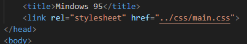
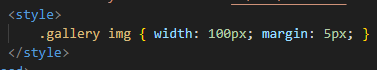
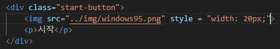

# 자기소개 웹사이트
> URECA_프론트엔드 이해_실습  
> (25.03.17)

## External CSS

- main.css를 만들어 link rel="stylesheet"로 적용

## Internal CSS

- gallery.html에서 style 태그를 사용해 내부 CSS 적용

## Inline CSS

- main.html에서 아이콘 크기 조정 시 style 속성 사용